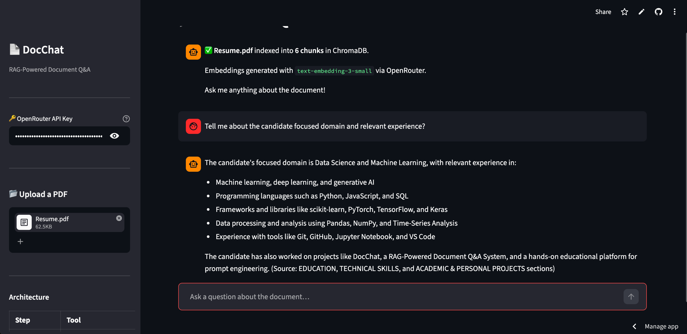

# 📄 DocChat — RAG-Powered Document Q&A

> Upload any PDF. Ask questions in plain English. Get answers grounded in the document with exact page citations.

[](https://docchat-sd8wat9fehfnscohpysxce.streamlit.app/)
[](https://python.org)
[](https://langchain.com)
[](https://trychroma.com)

---

## 🖥️ UI Preview



> **[👉 Try the live app](https://docchat-sd8wat9fehfnscohpysxce.streamlit.app/)** — bring your own [OpenRouter API key](https://openrouter.ai/keys) (free tier available)

---

## 🧠 How It Works

```
┌─────────────────────────────────────────────────────────┐
│                      PDF Upload                          │
└───────────────────────┬─────────────────────────────────┘
                        │
                        ▼
              pypdf — extract text per page
                        │
                        ▼
         RecursiveCharacterTextSplitter
          chunk_size=1000, overlap=200
                        │
                        ▼
        text-embedding-3-small (OpenRouter)
          → dense vector per chunk
                        │
                        ▼
                   ChromaDB
            cosine similarity index
                        │
                  (on each query)
                        │
                        ▼
         top-4 chunks retrieved by similarity
                        │
                        ▼
         Llama 3.3 70B via OpenRouter
      grounded answer + page citations
```

---

## 🛠️ Tech Stack

| Layer | Tool | Purpose |
|-------|------|---------|
| **UI** | Streamlit | Chat interface + PDF upload |
| **PDF Parsing** | pypdf | Extract text per page with metadata |
| **Chunking** | LangChain `RecursiveCharacterTextSplitter` | 1000-char chunks, 200-char overlap |
| **Embeddings** | `text-embedding-3-small` via OpenRouter | Dense vector representation |
| **Vector Store** | ChromaDB | Cosine similarity retrieval |
| **LLM** | Llama 3.3 70B via OpenRouter | Answer generation with grounding |

---

## 🚀 Run Locally

### 1. Clone & set up environment

```bash
git clone https://github.com/dabhiram13/DocChat.git
cd DocChat
python3 -m venv .venv
source .venv/bin/activate   # Windows: .venv\Scripts\activate
pip install -r requirements.txt
```

### 2. Add your API key

```bash
cp .env.example .env
# Paste your OpenRouter key into .env
```

Get a free key at [openrouter.ai/keys](https://openrouter.ai/keys).

### 3. Run

```bash
streamlit run app.py
```

Opens at **http://localhost:8501**

---

## 📖 Usage

1. Enter your **OpenRouter API key** in the sidebar
2. **Upload a PDF** (up to 200 MB)
3. Wait a few seconds — the document is parsed, chunked, embedded, and indexed into ChromaDB
4. **Ask any question** about the document in the chat
5. Expand **📚 Source passages** under each answer to see the exact chunks ChromaDB retrieved and the page numbers they came from

---

## 📁 Project Structure

```
DocChat/
├── app.py              # Streamlit UI — sidebar, upload, chat, citations
├── rag_pipeline.py     # RAG core — parse → chunk → embed → store → retrieve → generate
├── requirements.txt    # Pinned dependencies
├── runtime.txt         # Python 3.11 for Streamlit Cloud
├── .env.example        # API key template
├── docs/
│   └── screenshot.png  # UI preview (used in README)
└── .gitignore
```

---

## 💡 Key Design Decisions

**ChromaDB for vector storage** — cosine similarity retrieval gives semantically relevant chunks rather than keyword matches. Each session creates a fresh in-memory collection that's populated when the PDF is uploaded.

**Chunk overlap (200 chars)** — prevents answers from being cut off at chunk boundaries when context spans two adjacent chunks.

**Page-level citations** — every answer surfaces the exact page number and text excerpt it was drawn from, so responses are fully verifiable against the source document.

**OpenRouter for both LLM and embeddings** — single API key, single provider, consistent latency. `text-embedding-3-small` is fast and cost-efficient; Llama 3.3 70B gives strong reading comprehension for document Q&A.

---

## 🔑 API Key

This app uses the [OpenRouter](https://openrouter.ai) API for both embeddings and LLM inference.

- Sign up at [openrouter.ai](https://openrouter.ai) — free credits on registration
- Models used: `openai/text-embedding-3-small` + `meta-llama/llama-3.3-70b-instruct`
- No data is stored — documents are processed in memory and discarded when the session ends
